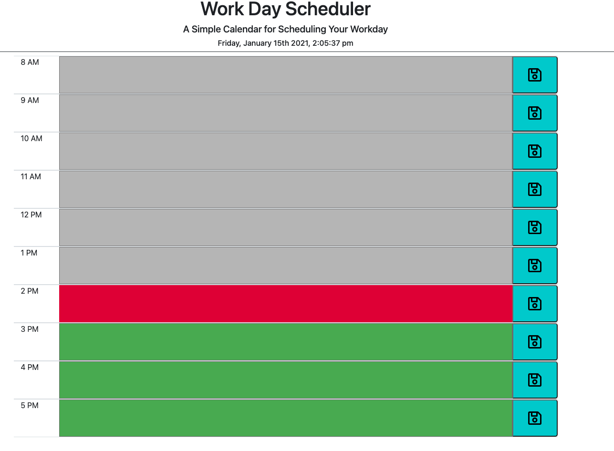

# Workday Schedular

# Deployed link:https://zohamumtaz.github.io/workday-schedule/
# github repo:https://github.com/zohamumtaz/workday-schedule
## how the schedular works.
* Workday Schedular is  made that shows the workday: 9AM-5PM.
* The day is shown in hour time slots.
* Each time slot is colored in different color to indicate whether it occured in the past hours (gray), present hour (red) or future hours green.
* Each time slot has an input field and 'save' button.
* Appointments can be made  to a specific time hour inline, and the 'save' button saves it to local storage.
* This applicationhas used  [jquery](https://jquery.com/) and [moment.js](https://momentjs.com/), and [Bootstrap](https://getbootstrap.com/).
